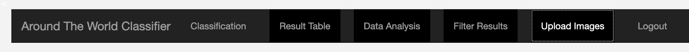
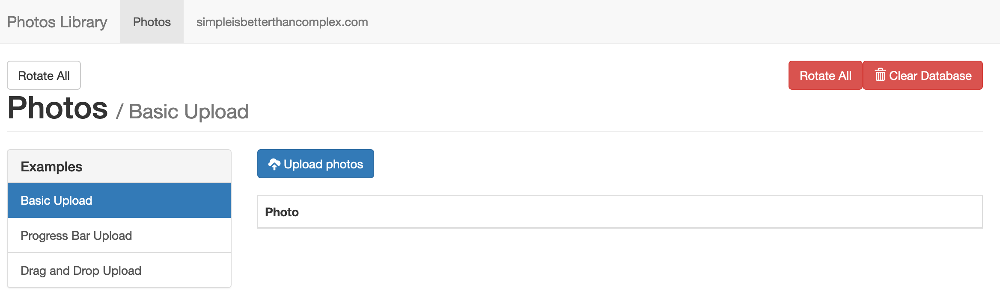
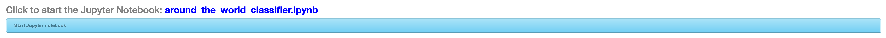
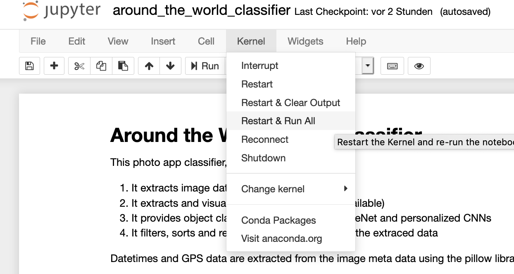

# Django-Webserver-Project

This is a Django webserver application. It incorporates Jupyter notebook operation and web page visualization of a deep learning - image classification topic. Via Jupyter notebooks the deep learning events and data exctration (image classification, GPS data, datetime) are processed, evaluated and documented. Image uploads, data analysis and classification results are organized and shown via web pages. Data analysis visualization is supported by Plotly plots, tables and image bags.


All Deep Learning classification events are placed inside the Jupyter notebook **around_the_world_classifier.ipynb**. It has four purposes:
1. It extracts datetimes (if available)
2. It extracts GPS data (if available)
3. It provides object classification via yolo3v, ImageNet and personified CNNs
4. It filters, sorts and rearranges images based on the extracted data

Datetimes and GPS data are extracted from the image meta data using the pillow library.

The photo classification is realized in three different approaches:
1. by using a yolov3 object detection algorithm. Here, I am using yolov3 pretrained wheights. Deep Learning Inference with own images enables a detection of up to 80 different classes within one image. A Boundary box with a class description is provided and stored in a separate folder **.../path_to_your_image_folder_name_** _yolo_class_  as well as stored in an html table (**your_image_folder_name.html**).
2. by using a CNN based pretrained model from Torchvision via Transfer Learning. As a standard VGG16 is chosen. However, you can replace VGG16 by any ozjer torchvision model. VGG16 is using the whole ImageNet classification system, The total number of classes is 1000. The file **data/imagenet_classes.txt** provides a dictionary of all one 1000 classes.
3. by using an own CNN based architecture with a layer combination of three times 'Conv-ReLU-MaxPool', deeply enough for sufficient feature extraction and an appropriate image size/feature reduction. The goal of this CNN is to filter personified images, e.g. to identify images of yourself. However, for this classification step you have to provide a dataset of at least 300 personified images. This CNN is not pretrained. You have to train it separately. For further information, follow the instruction in the Jupyter Notebook.


## Getting Started

These instructions will get you a copy of the project up and running on your local machine for development and testing purposes.

### Prerequisites: Installation of Python via Anaconda and Command Line Interaface
- Install [Anaconda](https://www.anaconda.com/distribution/). Install Python 3.7 - 64 Bit
- You need a Command Line Interface (CLI). If you are a Window user install [git](https://git-scm.com/)). Under Mac OS use the pre-installed Terminal.
- Upgrade Anaconda via
```
$ conda upgrade conda
$ conda upgrade --all
```

- Optional: In case of trouble add Anaconda to your system path. Write in your CLI
```
$ export PATH="/path/to/anaconda/bin:$PATH"
```
The project installation is divided into two parts: Part A describes the cloning of the project and the installation of the project environment. Part B describes Yolo weight settings for Transfer Learning, and the implementation of specific Django webserver settings.

### Project installation Part A
- Open Git Bash (Terminal, respectively)
- Change Directory to your project older, e.g. `cd my_github_projects`
- Clone the Github Project inside this folder with Git Bash (Terminal) vias:
```
$ git clone https://github.com/ddhartma/Around-The-World-Image-Classifier.git
```

- Change Directory
```
$ cd Around-The-World-Image-Classifier
```

- Create a new Python environment via the provided yml file. Inside Git Bash (Terminal) write:
```
$ conda env create -f env_windows.yml (under Windows)
$ conda env create -f env_macOS.yml (under Mac OS)
```

- Check the environment installation via
```
$ conda env list
```

- Activate the installed MTP_LSTM environment via
```
$ conda activate atw_macOS (Mac OS)
$ conda activate atw_windows
```

### Project installation Part B
- Download the [yolov3 weights](https://s3-us-west-1.amazonaws.com/udacity-aind/dog-project/dogImages.zip). Place this file in the repo-folder, at location `path/to/Around-The-World-Image-Classifier/atw_classifier/templates/data/config`.  This file contains the pretrained wheights for a yolov3 image detection with 80 classes. More details can be found [here](https://towardsdatascience.com/object-detection-and-tracking-in-pytorch-b3cf1a696a98).

- Get your [GMPAS API](https://developers.google.com/maps/documentation?hl=de)

- Put in this API in .../Around-The-World-Image-Classifier/atw_classifier/templates/layout.html in line 13 under src="ENTER YOUR GMAPS API HERE">

- Change directory to Django webserver
```
$ cd atw_classifier
```
- Apply migrations to Django webserver
```
$ python manage.py migrate
```
- Create an Admin
```
$ python manage.py createsuperuser
```
- Store your images under
```
$ .../Around-The-World-Image-Classifier/images
```

- Upload images. Click on 'UPLOAD IMAGES' in the Navigation Bar



- Then click on 'UPLOAD PHOTOS'. Choose images you want to classify. For automatic rotation correction click on 'ROTATE ALL'.



- Click on 'CLASSIFICATION' and click on the button 'start the Jupyter Notebook 'around_the_world_classifier.ipynb'



- Run the notebook for automatic classification. If you stored your images at a diddferent place then ''.../Around-The-World-Image-Classifier/images', provide the spoecific image path under 'PART A2 PATH SETTING'.



Enjoy!


## (Optionally) Accelerating the Training Process (personified image classification)

If your code is taking too long to run, you will need to either reduce the complexity of your chosen CNN architecture or switch to running your code on a GPU.  If you'd like to use a GPU, you can spin up an instance of your own:

#### Amazon Web Services

You can use Amazon Web Services to launch an [EC2 GPU instance](https://aws.amazon.com/de/ec2/). However, this service is not for free.

## Acknowledgments
* Please check out great Udacity Nanodegree programs, e.g. [Deep Learning](https://www.udacity.com/course/deep-learning-nanodegree--nd101)
